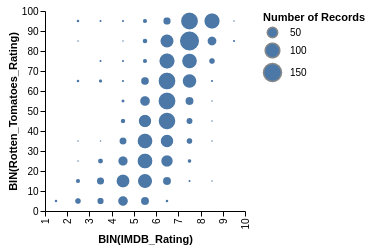

# VegaLite.jl

_Julia bindings to Vega-Lite_

|Julia versions | master build | Coverage |
|:-------------:|:------------:|:--------:|
|[](http://pkg.julialang.org/?pkg=VegaLite&ver=0.5) [](http://pkg.julialang.org/?pkg=VegaLite&ver=0.6) | [](https://travis-ci.org/fredo-dedup/VegaLite.jl) [](https://ci.appveyor.com/project/fredo-dedup/vegalite-jl/branch/master) | [](https://coveralls.io/github/fredo-dedup/VegaLite.jl?branch=master) |


This package provides access to the VegaLite v2 high-level visualization grammar from Julia.

`Vega-Lite` (http://vega.github.io/vega-lite/) is a simpler version of the Vega grammar (see https://vega.github.io/vega/ and its associated Julia API https://github.com/johnmyleswhite/Vega.jl) allowing smaller and more expressive chart specifications. Parts of the VegaLite package (rendering functions, IJulia integration) are based on Vega.jl (thanks !).

Install with `Pkg.add("VegaLite")`. Most functions are documented, with the full list of their properties listed and explained, e.g. type `? vlconfig` to get the full list of properties of the `vlconfig` function.


This package is essentially a thin layer between Julia and the VegaLite javascript library that translates Julia statements into a JSON graph specification. Statements such as :

```julia
data(url="https://raw.githubusercontent.com/vega/new-editor/master/data/movies.json") |>
  markcircle() |>
  encoding(xquantitative(vlbin(maxbins=10), field=:IMDB_Rating),
           yquantitative(vlbin(maxbins=10), field=:Rotten_Tomatoes_Rating),
           sizequantitative(aggregate=:count))
```

are translated to :
```JSON
{
  "encoding": {
    "x": {
      "bin": {
        "maxbins": 10
      },
      "field": "IMDB_Rating",
      "type": "quantitative"
    },
    "size": {
      "aggregate": "count",
      "type": "quantitative"
    },
    "y": {
      "bin": {
        "maxbins": 10
      },
      "field": "Rotten_Tomatoes_Rating",
      "type": "quantitative"
    }
  },
  "data": {
    "url": "https://raw.githubusercontent.com/vega/new-editor/master/data/movies.json"
  },
  "mark": {
    "type": "circle"
  }
}
```

Giving the plot :



The documentation provides a more detailed walk through of the Julia syntax.

When in the REPL or in the Juno IDE, the evaluation of VegaLite statements triggers the opening of a browser window showing the plot. In IJulia the plot is shown in the result block below.

It is possible to render plots to a file (supported formats are svg, png and pdf) by calling :
- `savefig(filename, plot)` with the file format guesssed form the file extension of `filename`
- or `svg(filename, plot)`, `pdf(filename, plot)` or `png(filename, plot)`

All contributions, PR or issue, are welcome !

## Examples:

### Scatter plot

```julia
using RDatasets

mpg = dataset("ggplot2", "mpg") # load the 'mpg' dataframe

mpg |> # add values ('data()' need the VegaLite qualification because it is exported by RDatasets too)
  markpoint() |>
  encoding(xquantitative(field=:Cty, axis=nothing),
           yquantitative(field=:Hwy, vlscale(zero=false)),
           colornominal(field=:Manufacturer)) |>    # bind color to :Manufacturer, nominal scale
  config(vlcell(width=350, height=400))
```


### Stacking multiple plots with `hconcat()` or `vconcat()`

```julia
using RDatasets

mpg = dataset("ggplot2", "mpg") # load the 'mpg' dataframe

r1 = markline() |>
     encoding(xquantitative(field=:Cty, axis=nothing),
              yquantitative(field=:Hwy, vlscale(zero=false)),
              colornominal(field=:Manufacturer)) ;

r2 = markrect() |>
      encoding(xquantitative(field=:Displ, vlbin(maxbins=5)),
               yquantitative(field=:Hwy, vlbin(maxbins=5)),
               colornominal(field=:Manufacturer)) ;

mpg |>
  vconcat(r1) |>
  vconcat(r2) |>
  config(vlcell(width=400))
```


### Using `layer()` to surimpose several plots

```julia
using DataFrames

df  = DataFrame(x=[0:5;], y=rand(6))

encx = xquantitative(field=:x)
ency = yquantitative(field=:y)

df |>
  plot(width=500) |>
  layer(markline(interpolate="linear"),
        encoding(encx, ency, vlcolor(value="green"))) |>
  layer(markline(interpolate="basis"),
        encoding(encx, ency, vlcolor(value="red"))) |>
  layer(markpoint(), encoding(encx, ency, vlcolor(value="black")))
```


### Using `repeat()` to facet a plot by data fields

```julia
using Distributions, DataTables

xs = rand(Normal(), 100, 3)
dt = DataTable(a = xs[:,1] + xs[:,2] .^ 2,
               b = xs[:,3] .* xs[:,2],
               c = xs[:,3] .+ xs[:,2])

dt |>
  repeat(column = [:a, :b, :c], row = [:a, :b, :c]) |>
  config(vlcell(width=100, height=100)) |>
  spec(markpoint(),
       encoding(xquantitative(vlfield(repeat=:column)),
                yquantitative(vlfield(repeat=:row))))
```


