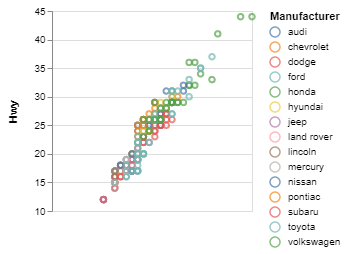
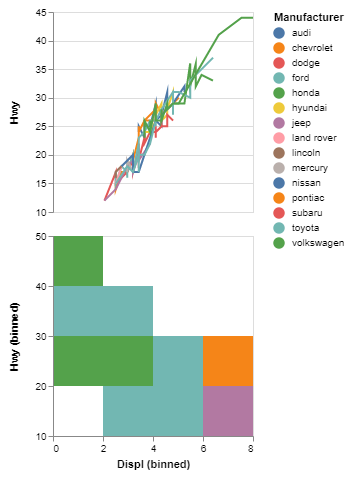
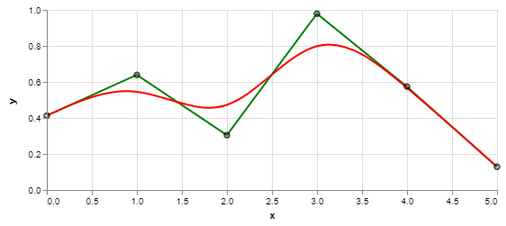

## Quick tour

### Simple scatter plot

Use functions linked by the `|>` operator to build your visuialization incrementally. VegaLite.jl can use DataFrames or DataTables as sources for data. For a scatter plot, specify that the mark should a point by `markpoint()`, then how the data in the DataFrame `mpg` (fields `:Cty`, `:Hwy` and `:Manufacturer`) should be connected to the encoding channels (x, y and color respectively). Finally, global configuration options are provided in a `config` function (type `? config``to see all the options).

```julia
using RDatasets

mpg = dataset("ggplot2", "mpg") # load the 'mpg' dataframe

mpg |> # start with the data source (here a DataFrame)
  markpoint() |>
  encoding(xquantitative(field=:Cty, axis=nothing),
           yquantitative(field=:Hwy, vlscale(zero=false)),
           colornominal(field=:Manufacturer)) |>    # bind color to :Manufacturer, nominal scale
  config(vlcell(width=350, height=400))
```



An alternative, more julian syntax, without the piping operator is also valid. The preceding statement can just as well be written :

```julia
plot(data(mpg),
     markpoint(),
     encoding(xquantitative(field=:Cty, axis=nothing),
              yquantitative(field=:Hwy, vlscale(zero=false)),
              colornominal(field=:Manufacturer)),
     config(vlcell(width=350, height=400)))
```


### Stacking multiple plots with `hconcat()` or `vconcat()`

Several independant plots can be concatenated vertically or horizontally :

```julia
using RDatasets

mpg = dataset("ggplot2", "mpg") # load the 'mpg' dataframe

r1 = markline() |>
     encoding(xquantitative(field=:Cty, axis=nothing),
              yquantitative(field=:Hwy, vlscale(zero=false)),
              colornominal(field=:Manufacturer)) ;

r2 = markrect() |>
      encoding(xquantitative(field=:Displ, vlbin(maxbins=5)),
               yquantitative(field=:Hwy, vlbin(maxbins=5)),
               colornominal(field=:Manufacturer)) ;

mpg |>
  vconcat(r1) |>
  vconcat(r2) |>
  config(vlcell(width=400))
```




### Using `layer()` to surimpose several plots

When several marks need to shown on the same visualization, use the `layer()` function :

```julia
using DataFrames

df  = DataFrame(x=[0:5;], y=rand(6))

encx = xquantitative(field=:x)
ency = yquantitative(field=:y)

df |>
  plot(width=500) |>
  layer(markline(interpolate="linear"),
        encoding(encx, ency, vlcolor(value="green"))) |>
  layer(markline(interpolate="basis"),
        encoding(encx, ency, vlcolor(value="red"))) |>
  layer(markpoint(), encoding(encx, ency, vlcolor(value="black")))
```



### Using `repeat()` to facet a plot by data fields

To create a facet plot with encoding channels cycled through a list of data fields
use the `repeat()` function :

```julia
using Distributions, DataTables

xs = rand(Normal(), 100, 3)
dt = DataTable(a = xs[:,1] + xs[:,2] .^ 2,
               b = xs[:,3] .* xs[:,2],
               c = xs[:,3] .+ xs[:,2])

dt |>
  repeat(column = [:a, :b, :c], row = [:a, :b, :c]) |>
  config(vlcell(width=100, height=100)) |>
  spec(markpoint(),
       encoding(xquantitative(vlfield(repeat=:column)),
                yquantitative(vlfield(repeat=:row))))
```


